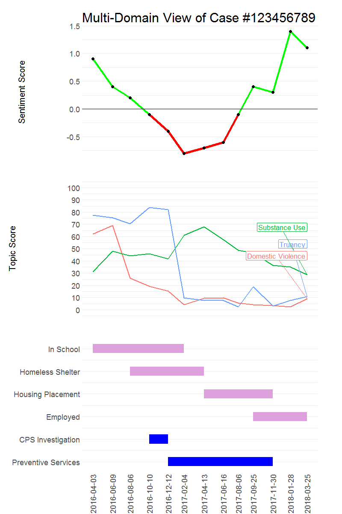
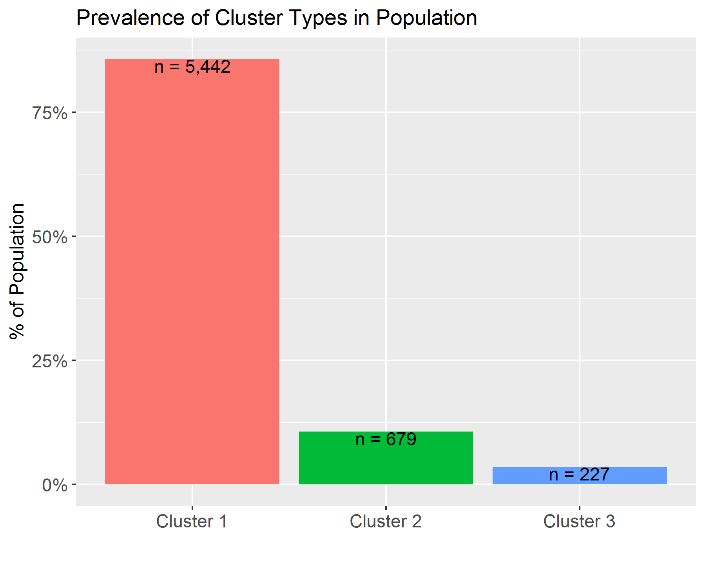

```{r setup, include=FALSE}
knitr::opts_chunk$set(echo = FALSE, message = FALSE, warnings = FALSE, error = FALSE)

### Load and--if necessary--install packages ----------------------------------#
package.list <- c("flexdashboard", "data.table", "dplyr", "stringr", "rgdal",
                  "MASS", "plotly", "leaflet", "ggplot2", "scales")
for (p in package.list){
  if (!p %in% installed.packages()[, "Package"]) install.packages(p)
  library(p, character.only = TRUE)
}

### Load custom functions -----------------------------------------------------#
grepv <- function(p, x, ...) grep(p, x, value = TRUE, ...)
cn <- function(x) colnames(x)

```

### Dashboard Demonstration

<br>
<br>
<font size = "4">
<p>This dashboard shows a handful of data visualization use cases for the Unstructured Data Analytics initiative of the Allegheny County Department of Public Health. This was developed by staff at Chapin Hall and its partners at Argonne National Laboratory.</p>
<ul>
<li> This was made with the free and open-source [R programming language](https://www.r-project.org/about.html)
<li> Code-driven dashboards like this can be automatically generated to be custom for any given user, and updated with new inputs, analysis, and visualization as part of the full analysis pipeline
<li> The code and data used to create this example can be found&mdash;and reused and contributed to&mdash;at [this open-source GitHub repository](https://github.com/chapinhall/acdhs-demo)
<li> **Note** that all data here is fake, intended only for the purpose of illustration
</ul>
</font>

### Case-Level Visualization



***

<ul>
<li> This figure combines
  <ul>
  <li> text-mined sentiment score
  <li> text-mined key topics of relevance
  <li> indication of institutional contacts, including DHS investigation and intervention
  </ul>
<li> Low sentiment scores could be used to trigger specific interventions or referrals to other practitioners, when combined with key topic combinations
<li> Topic and sentiment scores can help supervisors quickly review timely characteristics of individual cases or a worker's entire caseload
<li> Persistence of key topics can raise flags to QA teams to complete additional modules, e.g. related to housing concerns
</ul>

### System-Level Trajectory Visualization {data-commentary-width=500}

```{r generate prevalence figure to match trajectory viz}
df <- 
  data.frame(clus = c("Cluster 1", "Cluster 2", "Cluster 3"),
             freq = c(5442, 679, 227)) %>% 
  mutate(pct = freq/sum(freq),
         label = paste0("n = ", prettyNum(freq, big.mark = ",")))
myplot <-
  ggplot(df, aes(x = clus, y = pct, fill = clus)) +
  geom_bar(stat = "identity", position = "dodge") +
  geom_text(aes(label = label), vjust = 1) +
  scale_y_continuous(labels = percent) +
  labs(title = "Prevalence of Cluster Types in Population",
       x = "", y = "% of Population") +
  theme(legend.position = "none",
        axis.title = element_text(size = 12),
        axis.text = element_text(size = 11))
ggsave("img/dually-involved-youth_traj-viz_3-cluster--prevalence.png")
```

<!--  -->



  
***

<font size = "3">
<ul>
<li> Trajectory visualizations can show pathways of cases through institutional contacts
<li> Each individual trajectory is shown as a (narrow) horizontal line. Each subplot shows hundreds of individual cases, with cases sorted by their starting state, then the type and duration of the state that follows.
<li> These plots show the starting age, duration, sequence, and number of spells for different institutional contacts
<li> The multiple figures show different distinct cluster patterns. In this example:
  <ul>
  <li> "Cluster 1" represents individuals with short involvements which start at a range of ages
  <li> "Cluster 2" represents individuals with long, unbroken stints in child welfare cases. A third of this group has out-of-home placements, almost always at early ages.
  <li> "Cluster 3"--the smallest group--represents individuals with long stints of out-of home placements, generally starting at early ages.
  </ul>
<li> These institutional involvement cluster types can also be displayed in tables or maps
</ul>
</font>

### Macro-Planning

```{r generate macro planning data}
n <- 100
mp <- data.frame()

```


### System-Level Topic Map

```{r display zipcode map with topic layers}
# Get zipcode boundary data
zips <- readOGR(dsn = "data", layer = "Allegheny_County_Zip_Code_Boundaries", verbose = FALSE)

# Sample topics:
topics <- c("Pregnant", "Domestic Violence", "Opiates", "Suicide", "Low Income")
sigma <- matrix(c(1.0, 0.2, 0.1, 0.2, 0.4,
                  0.2, 1.0, 0.3, 0.4, 0.5,
                  0.1, 0.3, 1.0, 0.4, 0.6,
                  0.2, 0.4, 0.4, 1.0, 0.4,
                  0.4, 0.5, 0.6, 0.4, 2.0), nrow = 5)
mu <- c(0.8, 1.5, 0.0, -1.0, 1.0)

# Draw correlated values
set.seed(8062018)
draws <- mvrnorm(n = nrow(zips@data), mu = mu, Sigma = sigma)

# Put this on a 0-100 scale, label, and arrange in order (to give a pattern to matching with zips)
draws <- round((draws - min(draws))/(max(draws) - min(draws))*100, 1)
colnames(draws) <- topics
draws <- arrange(as.data.frame(draws), -`Low Income`)

# Attach values to zipcodes
zips@data <-
  cbind(zips@data, draws) %>% 
  within(topicPop <- paste0("<b>Topic Scores for Zip ", ZIP, "</b>:<br>",
                         "Pregnant: ",          sprintf("%1.1f", Pregnant), "<br>",
                         "Domestic Violence: ", sprintf("%1.1f", `Domestic Violence`), "<br>",
                         "Opiates: ",           sprintf("%1.1f", Opiates), "<br>",
                         "Suicide: ",           sprintf("%1.1f", Suicide), "<br>",
                         "Low Income: ",        sprintf("%1.1f", `Low Income`)))
palBin_blue <- colorBin(palette = "Blues", domain = c(0, 100), bins = 5)
myOpacity <- 0.7

leaflet(data = zips) %>% # width = "100%"
  #addTiles() %>%
  addProviderTiles("CartoDB.Positron") %>%
  addPolygons(group = "Pregnant", fillColor = ~palBin_blue(Pregnant),
              popup = ~topicPop, weight = 2.0, fillOpacity = myOpacity) %>%
  addPolygons(group = "Domestic Violence", fillColor = ~palBin_blue(`Domestic Violence`),
              popup = ~topicPop, weight = 2.0, fillOpacity = myOpacity) %>%
  addPolygons(group = "Opiates", fillColor = ~palBin_blue(Opiates),
              popup = ~topicPop, weight = 2.0, fillOpacity = myOpacity) %>%
  addPolygons(group = "Suicide", fillColor = ~palBin_blue(Suicide),
              popup = ~topicPop, weight = 2.0, fillOpacity = myOpacity) %>%
  addPolygons(group = "Low Income", fillColor = ~palBin_blue(`Low Income`),
              popup = ~topicPop, weight = 2.0, fillOpacity = myOpacity) %>%
  addLayersControl(baseGroups = c("Pregnant", "Domestic Violence", "Opiates", "Suicide", "Low Income"),
                   options = layersControlOptions(collapsed = FALSE)) %>%
  addLegend(position = "bottomleft", colors = unique(palBin_blue(0:100)),
            title = "Topic Scores",
            labels = c("0-20", "20-40", "40-60", "60-80", "80-100"))
```

***

* Dynamic maps offer panning, zooming, and "popup" annotations that allow exploration of geographic trends in various case topics and combinations thereof, such as "opiod" and "overdose"
* This map shows an example of multiple topic layers for Alleghency county zip codes, with more information available through clicking 

